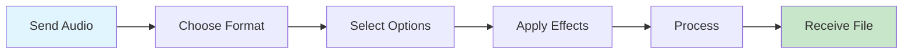

<div align="center">

# 🎵 TarangFX

### Transform Your Audio, Instantly

*A powerful Telegram bot that brings professional audio conversion and mastering to your fingertips*

[](https://www.gnu.org/licenses/agpl-3.0)
[](https://t.me/TarangFXbot)
[](https://github.com/PN-Projects/TarangFX)

[Features](#-what-makes-tarangfx-special) • [Quick Start](#-quick-start) • [Deploy](#-deployment-options) • [Documentation](#-how-it-works)

</div>

---

## 🎯 What Makes TarangFX Special?

<table>
<tr>
<td width="50%">

### 🎼 Format Versatility
Convert between **20+ audio formats** including MP3, FLAC, AAC, OPUS, WAV, and more. Whether you need lossy compression or lossless quality, TarangFX handles it seamlessly.

### ⚡ Lightning Fast
Built on asynchronous Pyrogram with FFmpeg's industry-standard processing engine. Experience rapid conversions without compromising quality.

</td>
<td width="50%">

### 🎛️ Professional Controls
Fine-tune your audio with precision controls for bitrate (128k–500k+), sample rate (up to 192kHz), and multi-channel configurations including 7.1 surround.

### 🔒 Privacy First
Zero database storage. Your files are processed and immediately deleted. No logs, no tracking, no data retention—just pure conversion power.

</td>
</tr>
</table>

---

## ✨ Feature Showcase

```
📊 Audio Enhancement          🎚️ Precision Controls         🔄 Format Freedom
├─ Bass Boost                 ├─ Bitrate Selection          ├─ Lossy Formats
├─ Audio Normalization        ├─ Sample Rate Tuning         │  • MP3, AAC, OGG
├─ Fade In/Out Effects        ├─ Channel Configuration      │  • OPUS, WMA, AC3
├─ Speed Adjustment           └─ Custom FFmpeg Filters      │  • AMR, WebM
├─ Audio Reversal                                           │
└─ Custom Filters             💾 File Support               └─ Lossless Formats
                              └─ Up to 2GB per file            • FLAC, WAV, ALAC
                                                               • APE, WV, TTA
```

---

## 🚀 Quick Start

### Prerequisites

<table>
<tr>
<td width="33%">

**Python 3.10+**
```bash
python --version
```

</td>
<td width="33%">

**FFmpeg**
```bash
ffmpeg -version
```

</td>
<td width="33%">

**Telegram Bot Token**

Get from [@BotFather](https://t.me/BotFather)

</td>
</tr>
</table>

### Installation Steps

<details>
<summary><b>🐧 Linux / macOS</b></summary>

```bash
# Clone the repository
git clone https://github.com/PN-Projects/TarangFX.git
cd TarangFX

# Create virtual environment
python3 -m venv venv
source venv/bin/activate

# Install dependencies
pip install -r requirements.txt

# Install FFmpeg (if not already installed)
# Ubuntu/Debian:
sudo apt-get update && sudo apt-get install -y ffmpeg libsndfile1
# macOS:
brew install ffmpeg libsndfile

# Configure environment
cp .env.example .env
nano .env  # Add your credentials

# Launch the bot
python bot.py
```

</details>

<details>
<summary><b>🪟 Windows</b></summary>

```powershell
# Clone the repository
git clone https://github.com/PN-Projects/TarangFX.git
cd TarangFX

# Create virtual environment
python -m venv venv
.\venv\Scripts\Activate

# Install dependencies
pip install -r requirements.txt

# Download FFmpeg from https://ffmpeg.org/download.html
# Extract and add to PATH

# Configure environment
copy .env.example .env
notepad .env  # Add your credentials

# Launch the bot
python bot.py
```

</details>

---

## ⚙️ Configuration

Create a `.env` file in the root directory:

```env
# Required: Telegram Bot Credentials
BOT_TOKEN=1234567890:ABCdefGHIjklMNOpqrsTUVwxyz
API_ID=12345678
API_HASH=abcdef1234567890abcdef1234567890

# Optional: Force Subscription
FORCE_SUB_CHANNEL=YourChannelUsername
# or use channel ID: FORCE_SUB_CHANNEL=-1001234567890
```

<details>
<summary>📖 Where to get these credentials?</summary>

- **BOT_TOKEN**: Message [@BotFather](https://t.me/BotFather) on Telegram
- **API_ID & API_HASH**: Visit [my.telegram.org](https://my.telegram.org/auth)
- **FORCE_SUB_CHANNEL**: Your channel username (without @) or channel ID

</details>

---

## 🐳 Docker Deployment

### Using Docker

```bash
# Build the image
docker build -t tarangfx-bot .

# Run the container
docker run -d \
  --name tarangfx \
  --env-file .env \
  --restart unless-stopped \
  tarangfx-bot
```

### Using Docker Compose

```bash
# Start the service
docker-compose up -d

# View logs
docker-compose logs -f

# Stop the service
docker-compose down
```

---

## ☁️ Deployment Options

Deploy TarangFX to your preferred cloud platform with one click:

<div align="center">

[](https://render.com/deploy?repo=https://github.com/PN-Projects/TarangFX)
&nbsp;&nbsp;&nbsp;
[](https://app.koyeb.com/deploy?type=git&repository=github.com/PN-Projects/TarangFX)

</div>

<details>
<summary><b>🎨 Render Deployment Guide</b></summary>

1. Click the "Deploy to Render" button above
2. Connect your GitHub account if prompted
3. Select **Docker** as the environment
4. Add environment variables from your `.env` file
5. Click "Create Web Service"
6. Wait for deployment to complete (2-3 minutes)

</details>

<details>
<summary><b>🚀 Koyeb Deployment Guide</b></summary>

1. Click the "Deploy to Koyeb" button above
2. Authorize Koyeb to access the repository
3. Choose your preferred region
4. Set environment variables from your `.env` file
5. Select Docker as the builder
6. Click "Deploy"

</details>

---

## 📖 How It Works

### User Flow



### Available Commands

| Command | Description |
|---------|-------------|
| `/start` | Initialize bot and display welcome message with main menu |
| `/help` | Access comprehensive help center and feature documentation |
| `/cancel` | Clear current session and reset processing state |

### Processing Pipeline

1. **Upload**: Send any audio file (up to 2GB)
2. **Configure**: Choose output format, bitrate, sample rate
3. **Enhance**: Apply optional effects like bass boost or normalization
4. **Convert**: FFmpeg processes your audio with selected parameters
5. **Download**: Receive your converted file with metadata preserved

---

## 🎼 Supported Formats

<table>
<tr>
<td width="50%">

### Lossy Compression
*Smaller file sizes, great for streaming*

- **MP3** – Universal compatibility
- **AAC/M4A** – High quality, Apple devices
- **OGG Vorbis** – Open-source standard
- **OPUS** – Best quality-to-size ratio
- **WMA** – Windows Media Audio
- **AC3/AMR** – Specialized formats
- **WebM** – Web-optimized audio

</td>
<td width="50%">

### Lossless Quality
*Perfect audio preservation*

- **FLAC** – Most popular lossless
- **WAV** – Uncompressed PCM
- **ALAC** – Apple Lossless
- **APE** – Monkey's Audio
- **WV** – WavPack compression
- **TTA** – True Audio codec
- **AIFF** – Audio Interchange format

</td>
</tr>
</table>

---

## 🏗️ Project Architecture

```
TarangFX/
│
├── 🤖 Core Components
│   ├── bot.py              # Main bot logic and message handlers
│   ├── client.py           # Custom Pyrogram client implementation
│   └── config.py           # Environment configuration and validation
│
├── 🎨 User Interface
│   ├── buttons.py          # Inline keyboard layouts and navigation
│   └── forcesub.py         # Subscription verification middleware
│
├── 📦 Dependencies
│   ├── requirements.txt    # Python package specifications
│   └── Dockerfile          # Container configuration
│
├── ⚙️ Configuration
│   ├── .env.example        # Environment template
│   ├── docker-compose.yml  # Orchestration setup
│   └── setup.sh            # Automated setup script
│
└── 💾 Runtime
    └── downloads/          # Temporary processing workspace (auto-cleaned)
```

---

## 🛠️ Technology Stack

<div align="center">


</div>

**Core Libraries**
- `pyrogram` – Asynchronous Telegram client framework
- `ffmpeg-python` – Python bindings for FFmpeg
- `pydub` – Audio file manipulation and analysis
- `librosa` – Advanced audio processing
- `soundfile` – Audio file I/O operations

---

## 🔍 Troubleshooting

<details>
<summary><b>❌ FFmpeg not found</b></summary>

**Solution**: Install FFmpeg for your operating system

```bash
# Ubuntu/Debian
sudo apt-get install ffmpeg libsndfile1

# macOS
brew install ffmpeg libsndfile

# Windows
# Download from https://ffmpeg.org/download.html and add to PATH
```

</details>

<details>
<summary><b>❌ Module not found error</b></summary>

**Solution**: Ensure virtual environment is activated and dependencies are installed

```bash
source venv/bin/activate  # Linux/macOS
# or
.\venv\Scripts\Activate   # Windows

pip install -r requirements.txt
```

</details>

<details>
<summary><b>❌ Bot not responding</b></summary>

**Solution**: Verify your credentials

1. Check `.env` file has correct values
2. Ensure `BOT_TOKEN` is valid (test with [@BotFather](https://t.me/BotFather))
3. Verify `API_ID` and `API_HASH` from [my.telegram.org](https://my.telegram.org)
4. Check bot logs for specific error messages

</details>

<details>
<summary><b>❌ Force subscription not working</b></summary>

**Solution**: Configure channel permissions

1. Add the bot as an administrator in your channel
2. Ensure `FORCE_SUB_CHANNEL` uses correct format:
   - Username: `YourChannel` (without @)
   - Or Channel ID: `-1001234567890` (with -100 prefix)

</details>

---

## 🤝 Contributing

We welcome contributions! Here's how you can help:

1. **Fork** the repository
2. **Create** a feature branch (`git checkout -b feature/amazing-feature`)
3. **Commit** your changes (`git commit -m 'Add amazing feature'`)
4. **Push** to the branch (`git push origin feature/amazing-feature`)
5. **Open** a Pull Request

### Development Guidelines

- Follow PEP 8 style guidelines
- Add comments for complex logic
- Test thoroughly before submitting
- Update documentation as needed

---

## 📜 License

This project is licensed under the **GNU Affero General Public License v3.0**

```
TarangFX - Audio Conversion & Mastering Bot
Copyright (C) 2024 PN Projects

This program is free software: you can redistribute it and/or modify
it under the terms of the GNU Affero General Public License as published
by the Free Software Foundation, either version 3 of the License, or
(at your option) any later version.
```

See the [LICENSE](LICENSE) file for full details.

---

## 👨‍💻 Meet the Team

<table>
<tr>
<td align="center">
<a href="https://t.me/dotenv">
<br />
<sub><b>Parthiv Katapara</b></sub>
</a><br />
<sub>Core Developer</sub>
</td>

<td align="center">
<a href="https://t.me/PrabodhNandini">
<br />
<sub><b>Avika Trivedi</b></sub>
</a><br />
<sub>Core Developer</sub>
</td>

<td align="center">
<a href="https://t.me/shhhwrma">
<br />
<sub><b>Anand Sharma</b></sub>
</a><br />
<sub>Core Developer</sub>
</td>
</tr>
</table>


---

## 🌟 Support

If you find TarangFX helpful, consider:

- ⭐ **Starring** this repository
- 🐛 **Reporting** bugs or suggesting features via [Issues](https://github.com/PN-Projects/TarangFX/issues)
- 💬 **Sharing** with others who might benefit
- 📱 **Trying** the bot at [@TarangFXbot](https://t.me/TarangFXbot)

---

<div align="center">

### Made with ❤️ by PN Projects

**[Website](https://github.com/PN-Projects)** • **[Telegram](https://t.me/PnProjects)** • **[Issues](https://github.com/PN-Projects/TarangFX/issues)**

⭐ Star us on GitHub — it helps!

</div>
